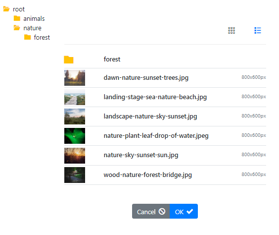

# File Tree Browser

## Demo

<https://www.file-tree-generator.miglisoft.com/>

[](https://www.file-tree-generator.miglisoft.com)

## Table of contents

* [Overview](#overview)
* [Quick start](#quick-start)
* [Options](#options)
* [How to customize the HTML/ CSS](#how-to-customize-the-html-css)
* [Connnectors](#connnectors)
* [Contribute](#contribute)
* [Versionning](#versionning)
* [Authors](#authors)
* [License](#license)

## Overview

**File Tree Browser** is a Javascript plugin built to **browse folders** and **select files**.

It retrieves directories and files recursively with Ajax from a main directory and displays the tree structure. You can browse and select, move files from folder to folder, do any stuff with the choosen file.

File Tree Browser is programmed in **Vanilla Javascript** (compiled TypeScript) and **doesn't require any dependency**.

a **PHP connector** is provided to retrieve the main directory content, you can write your own in any server language (NodeJS, ASP, ...).

The default template is built with Bootstrap 4, but Bootstrap is **not required** at all. You can easily **add your own HTML/CSS template** and change markup to fit your needs.

## Installation

Clone / download or install with npm

```bash
  npm install @migliori/file-tree-browser@1.1.1
```

## Quick start

* Upload the *dist* folder on your server
* add the HTML markup on your page:

```html
<!--
    This is a minimal example.
    You can change anything here,
    The File Tree Browser requires only a main wrapper
    with .ft-tree and .ft-explorer inside.
-->
<div id="custom-id">
    <div class="ft-tree"></div>
    <div class="ft-explorer"></div>
</div>
```

* add the Javascript code:

```javascript
<script src="dist/js/file-tree-browser.js"></script>
<script>
    document.addEventListener("DOMContentLoaded", function(event) {

        var options = {
            mainDir: '/path/to/directory',
            elementClick: function (filePath, fileName) {
                // do anything you want
            },
            cancelBtnClick: function (filePath, fileName) {
                // do anything you want
            },
            okBtnClick: function (filePath, fileName) {
                // do anything you want
            }
        };

        var ft = new FileTreeBrowser('file-tree-browser-wrapper', options);
    });
</script>
```

## Options

Name | type | Default Value | Description
---- | ---- | ----- | -------
connector | string | 'php' | connector file extension in `dist/connectors/connector.[ext]`
dragAndDrop | boolean | true | allow or disallow to drag files from folder to folder
explorerMode | string | 'list' | 'list' or 'grid'
extensions | array | ['.*'] | Array with the authorized file extensions
mainDir | string | 'demo-files' | main directory id
maxDeph | number | 3 | deph of the folders to browse from the main directory
cancelBtn | boolean | true | add a cancel button or not
cancelBtnText | string | 'Cancel' | text for the *Cancel* button
okBtn | boolean | true | add an OK button or not
okBtnText | string | 'Ok' | text for the *Ok* button
template | string | 'bootstrap4' | name of the HTML/CSS template files in *dist/templates/*
elementClick | function | `function (filePath, fileName) {console.log(filePath);    console.log(fileName);}` | callback function called when the user clicks any file in the explorer
cancelBtnClick | function | `function () { console.log('Cancel'); }` | callback function called when the user clicks the explorer *cancel* button
okBtnClick | function | `function (filePath, fileName) {console.log(filePath);    console.log(fileName);}` | callback function called when the user clicks the explorer *OK* button

## How to customize the HTML/ CSS

The template files are used to generate the File Explorer html code.

They are located in *dist/templates/*

### To create your own templates

* Create your HTML file + your css file with the same name for both in *dist/templates/*
* Your HTML template **MUST**:
  * include exactly the same *&lt;template&gt;* tags with the exact IDs as the default Bootstrap 4 template.
  ie:

    ```html
    <template id="explorer-mode">...</template>
    ```

  * Each *&lt;template&gt;* tag MUST include elements having the prefixed CSS classes `ft-`

* Load your template using the *template* option:

    ```javascript
    <script>
        document.addEventListener("DOMContentLoaded", function(event) {

            var options = {
                // ...
                template: 'your-custom-template'
            };

            var ft = new FileTreeBrowser('file-tree-browser-wrapper', options);
        });
    </script>
    ```

You can use any HTML structure, any element, as long as the templates are all present with their respective IDs, and all the necessary prefixed classes are present in each of them.

**WARNING**: if there's a missing *&lt;template&gt;* tag or a missing prefixed class, Javascript will throw the following console error:

```javascript
'Augh, there was an error!'
```

## Connnectors

The default connector is written in PHP.
You can write your own in any server language (nodeJs, ASP, ...). ie:

* create your connector file named *dist/connectors.connector.asp*
* Load it using the *connector* option:

    ```javascript
    <script>
        document.addEventListener("DOMContentLoaded", function(event) {

            var options = {
                // ...
                connector: 'asp'
            };

            var ft = new FileTreeBrowser('file-tree-browser-wrapper', options);
        });
    </script>
    ```

## Contribute

Any new connector or cool template is welcome!

## Versioning

We use [SemVer](http://semver.org/) for versioning. For the versions available, see the [tags on this repository](https://github.com/migliori/file-tree-browser/tags).

## Authors

* **Gilles Migliori** - _Initial work_ - [Migliori](https://github.com/migliori)

## License

This project is licensed under the GNU GENERAL PUBLIC LICENSE - see the [LICENSE](LICENSE) file for details
